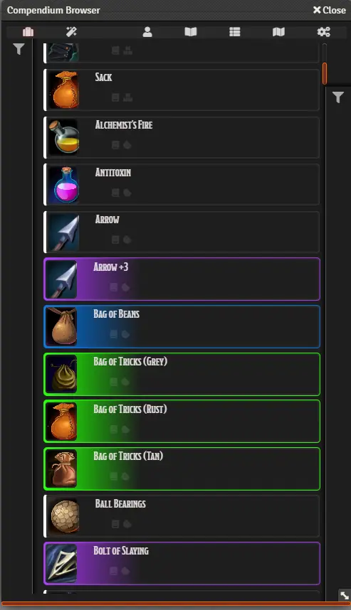

# Compendium Browser
**NEW in 0.5** Support for Foundry 0.8.x

Tired of scrolling compendia? Easily brows and filter for spells, feats, items, and NPCs using Compendium Browser.

Compendium Browser is faster and better-behaved; **it no longer loads all the compendia into memory on start-up** (which sometimes hung servers because of memory or CPU requirements). Instead, it filters and loads on-demand, as well as giving you a Module Setting to control how many rows are loaded at a time.

## Installation
1. Go to the Setup of the FoundryVTT instance
1. Go to the Add-on Modules tab
2. Click _Install Module_ and search for **Compendium Browser** 
   _or_ paste this link: `https://github.com/League-of-Foundry-Developers/compendium-browser/releases/latest/download/module.json`
3. Open your world and go to **Settings** > **Manage Modules** and enable Compendium Browser

## Details
Only the Gamemaster has access to the Settings, where they can enable or disable player access to the spell or npc-browser. It is **highly** recommended to disable any compendia that do not contain spell or should not be used in the NPC Browser. .

All filters featured in the app are included in can be found in `scripts/modules/entities.js/`.

## Summary
* **Authors**: 
  * **Daniel Böttner:**  [Github Profile](https://github.com/DanielBoettner) | [Join FVTT League Developers Discord](https://discord.gg/PHmVQrG5)
  * **Spetzel:** Discord Tag Spetzel#0103 | [Join FVTT League Developers Discord](https://discord.gg/PHmVQrG5)
  * **Felix Müller:** [e-mail](felix.mueller.86@web.de)
* **Version**: 0.7.9
* **Foundry VTT Compatibility**: >= 0.8.8
* **System Compatibility (If applicable)**: dnd5e
* **Translation Support**: en, de

## Contribution
If you feel like supporting this work, feel free to leave a tip at the original creators paypal felix.mueller.86@web.de
and/or use github funding options. 

## License
 Compendium Browser - a module for Foundry VTT - by <a xmlns:cc="http://creativecommons.org/ns#" href="https://github.com/syl3r86?tab=repositories" property="cc:attributionName" rel="cc:attributionURL">Felix Müller</a> is licensed under a <a rel="license" href="http://creativecommons.org/licenses/by/4.0/">Creative Commons Attribution 4.0 International License</a>.

This work is licensed under Foundry Virtual Tabletop [EULA - Limited License Agreement for module development v 0.1.6](http://foundryvtt.com/pages/license.html).
